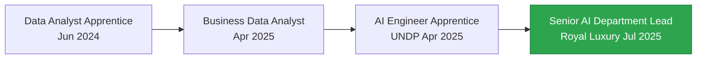

# 👋 Hi, I'm Ahmed Elsayed Elkhayat

**Senior AI Department Lead & Agentic AI Architect** @ Royal Luxury Construction  
📍 Abu Dhabi, UAE | 🎓 BE Computer Engineering - Mansoura University

[](https://www.linkedin.com/in/elkhayyat17/)
[](mailto:ahmedelkhayyat1@gmail.com)
[](https://github.com/elkhayyat17)

---

## 🚀 About Me

I'm pioneering **Agentic AI** in construction management — building autonomous systems that don't just respond to prompts, but **plan, execute, and monitor** complex workflows independently.

Currently leading the AI department at **Royal Luxury Construction**, where I've architected systems that enable AI agents to autonomously coordinate between Project Managers, Procurement, and HR departments through Odoo ERP integration.

```python
class AhmedElkhayat:
    def __init__(self):
        self.role = "Senior AI Department Lead"
        self.focus = ["Agentic AI", "ERP Integration", "RAG Systems"]
        self.current_project = "Daily AI Projects - One production-ready ML project every day"
        self.philosophy = "No shortcuts. Data to deployment. Production-ready."
    
    def expertise(self):
        return {
            "leadership": ["AI Strategy", "Digital Transformation", "Agentic Workflow Design"],
            "engineering": ["Python", "Odoo ERP", "MCP Protocol", "RAG", "LangChain"],
            "specialization": ["Autonomous AI Agents", "Enterprise AI", "Privacy-First ML"]
        }
```

---

## 🔥 Current Focus (Feb 2026)

🎯 **Daily AI Projects** - Building one complete ML pipeline every day  
📦 **3 Projects Completed**: Sentiment Analysis API, Image Classification, RAG Chatbot  
🏗️ **In Production**: Agentic Management System for Construction (Odoo + MCP)  
📚 **Learning**: Multi-agent orchestration, RL for autonomous agents

---

## 🛠️ Tech Stack

### Languages & Frameworks


### AI/ML Expertise
- **Agentic AI** | Model Context Protocol (MCP)
- **Large Language Models** | Fine-tuning (QLoRA, PEFT)
- **RAG Systems** | ChromaDB, Vector Databases
- **Deep Learning** | Transformers, Attention Mechanisms
- **ERP Integration** | Odoo (Advanced)

### Data & Analytics


---

## 🏆 Featured Projects

### 🤖 [Daily AI Projects](https://github.com/elkhayyat17/daily-ai-projects) 
**One production-ready AI project every day**  
`FastAPI` `Streamlit` `Docker` `LangChain` `ChromaDB` `DistilBERT` `ResNet50`

Complete ML pipelines: Data → Training → API → UI → Docker Container
- ✅ Real-Time Sentiment Analysis API (DistilBERT + FastAPI)
- ✅ Image Classification API (ResNet50 Transfer Learning)
- ✅ RAG Chatbot API (LangChain + ChromaDB + OpenAI)

---

### 🏗️ [Enterprise Agentic Management System](https://github.com/elkhayyat17/odoo-mcp-server) ⭐ Flagship
**Autonomous AI agents managing construction workflows**  
`Model Context Protocol` `Odoo ERP` `Autonomous Agents`

The system that changed everything. AI agents that **reason** about project costs, timelines, and resources — then execute changes directly in Odoo ERP. Currently in production at Royal Luxury Construction.

---

### 🦙 [Efficient Fine-Tuning for Llama2-7B](https://github.com/elkhayyat17/Efficient-fine-tuning-for-llama2-7b-and-quantize) ⭐ 1 star
**Memory-efficient LLM fine-tuning with QLoRA**  
`Llama 2` `QLoRA` `PEFT` `4-bit Quantization` `GGUF`

8x memory reduction through quantization. Complete pipeline from PEFT training to GGUF deployment.
- 4 comprehensive Colab notebooks
- Single GPU (T4 15GB VRAM) training
- HuggingFace integration

---

### 🏥 [Medical AI Projects](https://github.com/elkhayyat17)
**Privacy-preserving healthcare AI**
- 🩺 **Llama 2 Medical Chatbot** - Local inference with PDF knowledge base
- ❤️ **Heart Disease & Skin Cancer Diagnosis API** - Dual-model FastAPI deployment
- 🔒 **Privacy-first** - All inference runs locally (HIPAA compliant)

---

### 🔐 [Secure Internal RAG](https://github.com/elkhayyat17/Mistral7b_pdf_chatting)
**Privacy-first document analysis for sensitive contracts**  
`Mistral 7B` `Local Inference` `PDF Processing`

Built for construction contracts with NDAs. No data leaves the premises.

---

## 📊 GitHub Stats

<div align="center">
  


</div>

---

## 🎓 Certifications & Education

🎓 **Bachelor of Engineering** - Computer & Control System Engineering  
📍 Mansoura University (2019-2024) | Grade: **Excellent**

### 🏅 Top Certifications
- 🥇 **IBM AI in Production** - 100% (Capstone)
- 🥇 **Imperial College Linear Algebra** - 94%
- 🥇 **Imperial College Multivariate Calculus** - 92%
- 🥇 **Google IT Security** - 94.99%
- 🥈 **DeepLearning.AI Specialization** - 96% Neural Networks, 95% Sequence Models
- 🥈 **AWS Generative AI with LLMs** - 88.15%
- 🎖️ **UNDP Future Skills Academy** - Enterprise AI Track

---

## 💼 Professional Journey



**Current Role**: Senior of AI Department @ Royal Luxury Construction  
**Tenure**: July 2025 → Present  
**Key Achievement**: Architected Agentic AI system automating cross-departmental workflows

---

## 🌟 What Makes Me Different?

I don't just build AI tools — I build **Agentic AI systems** that think independently:

✅ **Autonomous** - Systems that plan, execute, and monitor without human intervention  
✅ **Production-First** - Every project is deployment-ready (Docker, APIs, CI/CD)  
✅ **Privacy-Aware** - Local inference for sensitive data (construction contracts, medical records)  
✅ **Full-Stack ML** - From data collection to Docker containers  
✅ **Business-Focused** - AI that drives ROI, not just academic metrics

---

## 📈 Current Goals (2026)

- [ ] Complete 30 production-ready AI projects (Daily AI Projects series)
- [ ] Publish case study on Agentic AI in construction management
- [ ] Scale autonomous agent system across all Royal Luxury departments
- [ ] Contribute to open-source AI agent frameworks
- [ ] Mentor 5+ emerging AI professionals in UAE

---

## 💡 Philosophy

> **"Beyond automation — building autonomous systems that reason, plan, and execute independently."**

I believe AI's future isn't about better chatbots — it's about **autonomous agents** that can manage entire business processes with minimal human oversight. My work at Royal Luxury Construction proves this isn't science fiction; it's happening now.

---

## 🤝 Let's Connect!

📧 **Email**: [ahmedelkhayyat1@gmail.com](mailto:ahmedelkhayyat1@gmail.com)  
📱 **Phone**: +971 56 766 0059  
💼 **LinkedIn**: [linkedin.com/in/elkhayyat17](https://www.linkedin.com/in/elkhayyat17/)  
🌐 **Digital Twin**: [View My Knowledge Graph](https://github.com/elkhayyat17/Elkhayyat-Digital-Twin)

---

## 🎯 Open to

✅ **Consulting**: Agentic AI implementation for enterprise  
✅ **Speaking**: AI strategy, autonomous systems, construction tech  
✅ **Collaboration**: Open-source AI agent frameworks  
✅ **Mentorship**: Emerging AI professionals in MENA region

---

<div align="center">

### ⚡ "Building the future, one autonomous agent at a time" ⚡


**Last Updated**: February 14, 2026 | **Auto-generated from [Digital Twin](https://github.com/elkhayyat17/Elkhayyat-Digital-Twin)**

</div>
